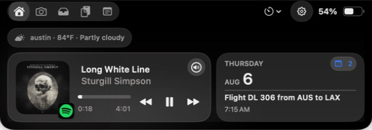
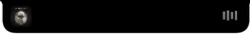
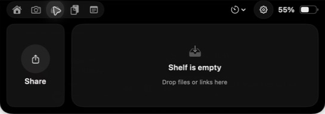

<p align="center">
  
</p>

<h1 align="center">MacIsland</h1>

<p align="center">A native macOS island for the notch: media, calendar, weather, files, notes, timers, and system controls in one focused surface.</p>

<p align="center">
  <a href="https://github.com/NimaJafariComp/MacIsland/releases"></a>
  <a href="LICENSE"></a>
  <a href="https://github.com/NimaJafariComp/MacIsland"></a>
</p>

<p align="center">
  <a href="https://github.com/NimaJafariComp/MacIsland/releases">Download the latest DMG</a>
  ·
  <a href="#build-from-source">Build from source</a>
  ·
  <a href="#license-source-and-notices">License and notices</a>
</p>



MacIsland keeps useful, time-sensitive controls at the top of your screen without turning the menu bar into another dashboard. It is written in SwiftUI and AppKit for macOS and adapts its island height to the active surface.

## What’s in the island

| Surface | What it does |
| --- | --- |
| **Now Playing** | Shows active media with artwork, transport controls, progress, volume, output selection, and provider-aware playback |
| **Calendar & reminders** | Surfaces today’s schedule and opens a resizable day view with a direct path to Apple Calendar |
| **Weather** | Shows local conditions using your current location or a city you choose in Settings |
| **Shelf & snippets** | Keeps dropped files, links, and clipboard history within reach for sharing and reuse |
| **Quick Notes** | Creates notes in the macOS Notes app and keeps recent notes available in the island |
| **Mirror** | Opens a camera preview with a software ring-light treatment and privacy-first pinned behavior |
| **Timers & system controls** | Includes countdown timers, stopwatch, battery details, and optional system HUD replacement |

## Screenshots

| Collapsed media | Home | Shelf |
| --- | --- | --- |
|  |  |  |

These captures come from the current Debug app. They are repository-owned UI evidence, not mockups or third-party artwork.

## Install from a release

1. Download the latest `MacIsland-*-arm64-adhoc.dmg` from [GitHub Releases](https://github.com/NimaJafariComp/MacIsland/releases)
2. Drag `MacIsland.app` to `Applications`, then open it and complete the setup flow
3. Choose the features you want in MacIsland Settings, including Launch at Login

> Current GitHub DMGs are ad-hoc evaluation builds. They are not Developer ID signed or Apple-notarized, so Gatekeeper can show a warning. See [RELEASE.md](RELEASE.md) for signing and release requirements.

## Build from source

MacIsland targets macOS 14 or later. Development uses macOS 15.6 or later and Xcode 26 or later.

```bash
xcodebuild \
  -project MacIsland.xcodeproj \
  -scheme MacIsland \
  -configuration Debug \
  -derivedDataPath /private/tmp/macisland-derived \
  CODE_SIGNING_ALLOWED=NO \
  build
```

This command writes the Debug product to `/private/tmp/macisland-derived/Build/Products/Debug/MacIsland.app`. Open `MacIsland.xcodeproj` in Xcode when you need signing, debugging, or macOS permission prompts.

## Validate a change

Run the project delivery gate before packaging a release:

```bash
Scripts/validate-xcode.sh
```

The repository also includes a repeatable visual-audit workflow. It records display metadata with captures and avoids claiming interaction coverage when the host lacks Assistive Access.

```bash
Scripts/visual-audit.sh /path/to/MacIsland.app /absolute/path/to/audit-output home
Scripts/verify-ui-baselines.sh Audit/Baselines/native-2x/manifest.plist
```

See [AGENTS.md](AGENTS.md) for implementation, test, and release rules.

## Project layout

| Path | Purpose |
| --- | --- |
| `MacIsland/` | SwiftUI, AppKit, models, managers, and bundled resources |
| `MacIslandTests/` | Unit and behavior tests |
| `Scripts/` | Build, validation, visual-audit, packaging, and release scripts |
| `RELEASE.md` | Signing, notarization, source-offer, and distribution requirements |

## License, source, and notices

Copyright © 2026 Nima Jafari.

MacIsland is licensed under [GNU GPL-3.0-or-later](LICENSE). The corresponding source for any binary release is the source at its matching [`v<version>` tag](https://github.com/NimaJafariComp/MacIsland/tags), including the build scripts and dependency-resolution metadata in this repository.

MacIsland contains modifications derived from [Boring Notch](https://github.com/TheBoredTeam/boring.notch) revision `8dd02e7555cbe48899524c61d24e50703e68ff68`. Legal attribution is preserved in [NOTICE](NOTICE), and third-party notices are preserved in [THIRD_PARTY_LICENSES](THIRD_PARTY_LICENSES).
